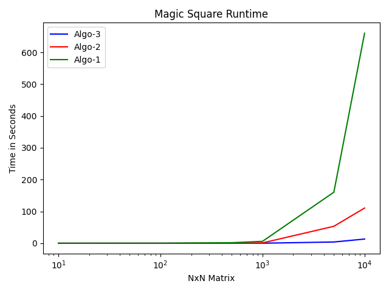
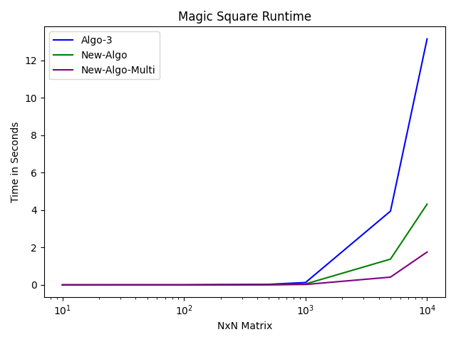

<!--MetaData
Title: Magic Squares in Grid: CPU Utilization Case Study
Published: January 10, 2026
Edited: January 10, 2026
Preview:
In this article, we take a relatively simple looking LeetCode problem, Magic Squares in Grid,
and proceed to preform numerous optimization techniques on O(n^2) solutions. 
In doing this, we show that by understanding CPU utilization and cache memory you can achieve up to a 375x speedup,
taking a (10^4 x 10^4) matrix process time from 11 minutes down to 1.6 seconds.
-->
<!--
PLAN:
1. Introduce Magic Square Problem
2. Introduce Brute Force Solution and explain O(n^2) runtime.
3. Introduce the 2 baseline algorithms (Sum Sums extreme one and Among us Reasonable one)
4. Show my basic optimization and explain why it should have speed up
5. showcase start small matrices within leetcodes bounds and show how it doesn't matter
6. Now scale it up and show the first graph and explain why this happend 
7. Introduce improved cache misses but no speed up (arithmetic bottle neck)
8. Introduce Matrix checking idea and how we lead to it with graph theory.
9. Showcase new algorithm 
10. showcase parallelized algorithm
11. Summarize
-->
### Table of Contents
1. Introduction: Magic Squares in Grid.
2. Brute Force Solutions
3. Brute Force Benchmarks
4. New Algorithm 
5. Conclusion

## 1. Introduction: Magic Squares in Grid.
LeetCode problem [840. Magic Squares in Grid](https://leetcode.com/problems/magic-squares-in-grid/description/), asks the following:  
Given a grid of size `n*m`, where `1<= n, m <= 10` and `0<=grid[n][m]<=15`. Find the number of **magic squares** within this grid.  
A **magic square** is defined as a `3x3` grid filled with distinct numbers **from 1 to 9** such that each row, column, and both diagonals all have the same sum.  
<pre><code>
Example:
4 3 8
9 5 1 ==> is a magic square
2 7 6

while,

3 8 4
5 1 9 ==> is not a magic square
7 6 2
</code></pre>

*Spoiler: we will reveal the solution, so if you want to solve the problem first please stop reading.*

### Brute Force Solution:
By doing some bounds analysis we see that the maximum size grid we have to process is 10x10, leaving us with just 100 elements (10x10 = 100). Using the [USACO time complexities table](https://leetcode.com/problems/magic-squares-in-grid/description/), where n = #of elements = 100, we can see that we can have up to O(n3) algorithm. This leaves us with some space to work with in regards to time complexity. Luckily, it so happens to turn out that a simple brute force is only O(n2), which is well below our O(n3) upper bound.

A simple brute force would be to iterate over all possible 3x3 squares within the grid and manually add up each row, col, and diagonal, to check if they all equal.
<pre><code>
PSEUDO CODE:
for row in rows:
    for col in cols:
        if(out_of_bounds) return # ensure we are in 3x3 range
        sum_rows = ...
        sum_cols = ...
        sum_diag = ...

        if(sum_rows,sum_cols,sum_diags equal and each number is unique 1 to 9)
            ans += 1        
# remember every row and col and diag must equal.
</code></pre>

As you can see from the sample pseudo code, a solution is more tedious than complex, but how does it perform?

## 2. Brute Force Solutions
To answer the question presented in the previous section, we will look at 3 brute force solutions O(n2), but all with different programming styles. Note: these are real solutions borrowed from my friends, but pulling samples from the solutions tab would work too. Also, Algo 1 & 2 will be shown in python as they submitted it, while algo 3 will be in C++. For the sake of fair benchmarking Algo 1 & 2 were translated into C++, but the code will not be presented here for readability. For those interested, the code will be public on GitHub soon.

### Algorithm 1
<pre><code>
class Solution:
    def numMagicSquaresInside(self, grid: List[List[int]]) -> int:
        n, m, ans = len(grid), len(grid[0]), 0
        for i in range(n-2):
            for j in range(m-2):
                dist = grid[i][j:j+3] + grid[i+1][j:j+3] + grid[i+2][j:j+3]
                rows = [sum(grid[k][j:j+3]) for k in range(i, i+3)]
                cols = [sum(grid[i][k] for i in range(i, i+3)) for k in range(j, j+3)]
                diag = [sum(grid[i+k][j+k] for k in range(3)), sum(grid[i+k][j+2-k] for k in range(3))]
                ans += len(set(rows + cols + diag)) == 1 and sorted(set(dist)) == list(range(1, 10))
        return ans
</code></pre>
Algorithm 1 (Algo 1) was written by my competitive programmer friend. When they solve LeetCode they attempt to do it with as little lines as possible, and as fast as possible, while maintaining somewhat decent code. Therefore, the code looks very weird due to the one-line for-loops.  

However, this algorithm is very simple:
1. Loops through all possible 3x3 squares in the grid
2. Calculates a grouping (dist)
3. Calculates rows, cols, diags
4. Then checks at the end if their sums equal and if we have distinct numbers (1-9)
5. Repeat 

Some initial concerns:
1. A lot of array allocation through array slicing
2. Sets, list generation, and sorting
3. Extra for-loops generate extra conditionals

*We will go more in-depth later*

### Algorithm 2
<pre><code>
class Solution:
    def isMagicSquare(self, grid, r, c):
        s = grid[r][c] + grid[r][c+1] + grid[r][c+2]
        seen = set()

        for i in range(3):
            for j in range(3):
                num = grid[r+i][c+j]
                if num < 1 or num > 9 or num in seen:
                    return False
                seen.add(num)

        for i in range(3):
            if grid[r][c+i] + grid[r+1][c+i] + grid[r+2][c+i] != s:
                return False
            if grid[r+i][c] + grid[r+i][c+1] + grid[r+i][c+2] != s:
                return False

        if grid[r][c] + grid[r+1][c+1] + grid[r+2][c+2] != s:
            return False
        if grid[r][c+2] + grid[r+1][c+1] + grid[r+2][c] != s:
            return False

        return True

    def numMagicSquaresInside(self, grid):
        m, n = len(grid), len(grid[0])
        cnt = 0

        for i in range(m - 2):
            for j in range(n - 2):
                if self.isMagicSquare(grid, i, j):
                    cnt += 1
        return cnt
</code></pre>

Algorithm 2 (Algo 2) was written by another one of my friends. Compared to the last code this looks a lot more readable, but with just more lines of code (which isn't a problem).  
Lets break down the algorithm:
1. For loop on the outside to check all 3x3 squares and calls calculation function (cleans up nesting)
2. Uses a *seen* set to find distinct numbers 1-9 and terminates early if condition isn't met.
3. Calculates all rows/cols and checks the sum and terminates early.
4. Calculates diagonals and checks sum and terminates early
5. if passes return True
6. go back to outside loop and repeat

We seen in this code a common technique of terminating early so we don't do unnecessary calculations. Overall the code is fine.

Initial Concerns:
1. A lot of branches
2. Using a set
3. Recursive calls

In theory this algorithm should perform much better than algorithm 1.
1. Less array allocation (no array slicing)
2. Less redundant operations (no sorting, list generation, or repeated sums)

*But will this be true?*

### Algorithm 3
<pre><code>
class Solution {
public:
int numMagicSquaresInside(vector<vector<int>>& grid) {
    int rows = grid.size(), cols = grid[0].size();
    int MASK = 0b1111111110; // LSB is never used
    int ans[2] = {0,0};
    for(int row = 0; row < rows - 2; row++){
        for(int col = 0; col < cols - 2; col++){
            // ILP
            int row1_sum = grid[row][col] + grid[row][col+1] + grid[row][col+2];
            int row1_check = (1 << grid[row][col]) | (1 << grid[row][col+1]) | (1 << grid[row][col+2]);
            
            int row2_sum = grid[row+1][col] + grid[row+1][col+1] + grid[row+1][col+2];
            int row2_check = (1 << grid[row+1][col]) | (1 << grid[row+1][col+1]) | (1 << grid[row+1][col+2]);
            
            int row3_sum = grid[row+2][col] + grid[row+2][col+1] + grid[row+2][col+2];
            int row3_check = (1 << grid[row+2][col]) | (1 << grid[row+2][col+1]) | (1 << grid[row+2][col+2]);

            int col1_sum = grid[row][col] + grid[row+1][col] + grid[row+2][col];
            int col2_sum = grid[row][col+1] + grid[row+1][col+1] + grid[row+2][col+1];
            int col3_sum = grid[row][col+2] + grid[row+1][col+2] + grid[row+2][col+2];

            int dag1 = grid[row][col] + grid[row+1][col+1] + grid[row+2][col+2];
            int dag2 = grid[row][col+2] + grid[row+1][col+1] + grid[row+2][col]; 
            
            int sum_check = (row1_sum == row2_sum) & (row2_sum == row3_sum) & 
            (row3_sum == col1_sum) & (col1_sum == col2_sum) & (col2_sum == col3_sum) & (col3_sum == dag1) & (dag1 == dag2);
            int unique_check = row1_check | row2_check | row3_check;
            
            int idx = (MASK == unique_check) & sum_check ? 0 : 1;
            ans[idx] += 1;
        }
    }
    return ans[0];
}
};
</code></pre>

Algorithm 3 (Algo 3) is my code written in C++, while ugly, it is meant to take advantage of CPU optimizations. Here is a algorithm break down.
1. Instead of using a set I use a bitmask to mark if we have seen numbers 1-9.
2. Loop through every 3x3 square
3. Calculate rows / cols / diagonals sums.
4. check all sums and unique property
5. do a conditional move on the index to write to (0 is if it is magic, 1 is the opposite)
6. Repeat until all squares are done

While the code is ugly, and not nice to scale for bigger grids *since we would have to manually add new instructions*, it utilizes key CPU utilization techniques:
1. Instruction Level Parallelism - All row/col/dag operations can happen in parallel
2. No branches: the ternary is a conditional move into an array index 
3. No complex data-structures / algorithms - (no sets, sorting, etc)

Initial Concerns:
1. A lot of operations (no early termination, every square runs all arithmetic)
2. Is the ugly code justified? - code is ugly but is it fast?

Theoretically this code should run the fastest, but as you know we can never guess about performance, so lets break out the benchmarks.

## 3. Brute Force Benchmarks

To test these algorithms I translated both Algo 1 & 2 into C++ (for fair comparison) and wrote a sample benchmarking program in C++20, compiled with no flags. The benchmarking program will populate an array of NxN dimensions, and then feed it to the respective algorithm. We will use perf to get a detailed understanding of whats happening behind the scenes. All experiments were ran on Ubuntu 24.04, I7 6700k 4 core CPU, and 48GB of ram. 

### The results:
*All results will be displayed in seconds*

#### Matrix 101x101
Lets first test the worst case LeetCode size (Matrix: 10x10). 
Results (displayed in seconds):
1. Algo 1: 0.001s
2. Algo 2: 0.001s
3. Algo 3: 0.001s

Welp, it seems all algorithms run in the same amount of time on a 10x10 matrix. Does that mean the optimizations are pointless? Well lets grow the matrix past LeetCodes maximum allowed size.   

#### Matrix 102x102
Results:
1. Algo 1: 0.059s
2. Algo 2: 0.012s
3. Algo 3: 0.002s

Now we are starting to see some differences in speed like we expected. Our algorithm (3) is 6x efficient as (2) and 30x better than (1). However, these aren't even at a second yet, so before we celebrate lets keep growing the search space to see if our optimizations really mattered.

#### Matrix 103x103
Results:
1. Algo 1: 6.027s
2. Algo 2: 1.043s
3. Algo 3: 0.128s

Now we are starting to see some major speedup. While both algorithms (1, 2) are now over a second long, our algorithm only runs in 128 milliseconds. (3) is 8.14x better than (2), and 47.08x better than (1).

Now lets keep scaling...

#### Matrix 104x104
Results:
1. Algo 1: 660.057s
2. Algo 2: 110.593s
3. Algo 3: 13.157s

At this size of a matrix we see (1) takes 11 minutes to run (50.76x), (2) takes almost 2 minutes (8.46x), and ours is only 13 seconds.

Lets put these results on a graph and see whats happening visually.

#### Understanding the Results

We see all algorithms follow a quadratic curve, but just at a different constant factor. This is because our core algorithm is O(n2) and unless we change something fundamental about our algorithm we will never be able to prevent that growth rate, but it does show with efficient code we can get significantly more milage out of our algorithms.

Now why are we seeing these results? Well, Algo 1 simply has too many extra things going on behind the scenes, mainly the array allocation. In order to do array slicing you must allocate a new array every time you slice. This comes at a massive cost which we can see. However, Algo 2 is a lot more interesting. If we compare Algo 2 and 3, at a high level, the only real optimization difference we see is the use of a bitmask over a set, everything else is just if statements, but that is the key here. 

By writing more predictable code (one with less branches or a more predictable pattern) and a little more instruction level parallelism, we can achieve an 8x speedup. This is because we can achieve higher levels of efficient pipeling in our CPU, since we don't have to perform expensive pipeline flushes on branch-misses. These are fundamentally the same algorithm but it goes to show that with slight design changes, which favor the CPU, we can squeeze a lot more performance out of a system.

However, lets kick it up a notch.

## 4. New Algorithm 

Now that we got some easy optimizations out of the way lets think of something more complex, the cache. In the code, I stored the matrix as integers. An integer, or int, takes up 4 bytes, and on a 105x105 matrix it takes about 40 gigabytes of data. 40GB is too large to fit into cache, so maybe if we shrink the size of the matrix we can fit more of the array into cache and therefore have less caches-misses and more performance. To apply this optimization one must realize we only have numbers up to 15, which means we can represent all numbers within an unsigned 4 bits, however, due to simplicity I rounded up to a single byte. This reduces are memory down to 10GB a 4x improvement, but did this actually do anything?

If we use perf on our algorithm (3) with a 105x105 matrix, we go from 2 billion cache-misses down to 1 billion cache misses. This is what we should expect since we can fit more into cache, but it actually doesn't improve the runtime. Since it doesn't improve our runtime it shows that our calculations take longer than our memory accesses, but how will we fix our arithmetic?

Changing our arithmetic requires a fundamental change to our algorithm, no longer will it be a simple brute force, but a more intelligent solution. To lead me to this solution I first had the realization that we don't need to think about the whole matrix, but instead only think about the 3x3 matrices. If we narrow our search space down to only 3x3 matrices with unique numbers of 1-9 we can reduce the number of possible searches down to 9! or 362880 matrices. However, checking 9! matrices per 3x3 square in the grid is obviously going to be slower than brute forcing the calculations, so why don't we reduce our search space down to only the number of valid matrices (i.e. only magic squares). When we put this restriction on we go from 9! down to only 8 matrices.

However, 8 matrices is still too many operations. To check if a 3x3 grid is equal to another 3x3 grid you must check each element, which is 9 comparisons. If we have 8 matrices to check then we would have to run 9*8 (72) comparisons per 3x3 square. This is still too many operations when compared to brute forcing the arithmetic, but there is one trick left.

If you notice the 8 matrices are all just different rotations of one matrix:
<!-- <pre><code>
2, 7, 6,  2 9 4 
9, 5, 1,  7 5 3
4, 3, 8,  6 1 8

4, 3, 8,  4 9 2 
9, 5, 1,  3 5 7
2, 7, 6,  8 1 6

6, 1, 8,  6 7 2
7, 5, 3,  1 5 9
2, 9, 4,  8 3 4

8, 1, 6,  8 3 4
3, 5, 7,  1 5 9 
4, 9, 2,  6 7 2
</code></pre> -->
<pre><code>
M1
2, 7, 6, 
9, 5, 1, 
4, 3, 8, 

M2
2, 9, 4, 
7, 5, 3, 
6, 1, 8, 

M3
4, 3, 8, 
9, 5, 1, 
2, 7, 6, 

M4
4, 9, 2, 
3, 5, 7, 
8, 1, 6, 

M5
6, 1, 8, 
7, 5, 3, 
2, 9, 4, 

M6
6, 7, 2, 
1, 5, 9, 
8, 3, 4, 

M7
8, 1, 6, 
3, 5, 7, 
4, 9, 2, 

M8
8, 3, 4, 
1, 5, 9, 
6, 7, 2, 
</code></pre>

We can exploit this property beautifully, with a little simple graph theory. 

Notice how in each matrix the corners are [2,6,4,8], the middle elements are [7,1,9,3] and the center is always 5. The 5 never rotates meaning the outer-shell is some possible rotation of a valid square. Therefore we can check if a 3x3 square is valid, by seeing if the outer-shell is a valid rotation, but how we will traverse this?

Notice how the corner pieces are always connected to the middle element. 8 --> [1,3], 4 --> [3,9], 2 --> [9,7], 6-->[7,1]

<pre><code>
If we set this as our base matrix (M8):
8 3 4
1 5 9 
6 7 2

We can represent the outer shell as a graph:
   8*
  / \ 
 1   3
 |   |
 6*  4*
 |   |
 7   9
  \ /
   2*
Any nodes with a * are valid entry points.
We must travel in one direction (left or right) and attempt to make it back to the start (complete the cycle)
</code></pre>

With this idea we only need to complete one cycle around the graph which is only 8 comparisons, meaning we can check all possible 3x3 matrices within only 8 comparisons.
In order to traverse this outer-shell we must establish a direction, which tells us the orientation of our matrix. To prove the necessity of a direction, and why we can't just always traverse right, lets take M7 and M8 as an example. If we say our direction is always right, then on M7 8 will always connect to 1 first, but on M8 8 will always connect to 3, these are two separate directions, but once we figure out the direction we can traverse correctly. Put simply, each root node has 2 branches, and we have to decide which branch to go down.

Here is the code:
<pre><code>
int new_algo(){
    const char DIR_FORWARD = 1;
    const signed char DIR_BACKWARD = -1;
    const char SINK = 10;

    // char for maximum cache storage
    const signed char path[] = {1,8,3,4,9,2,7,6,1,-1,-1,-1};
    const char path_idx[] = {SINK,SINK,5,SINK,3,SINK,7,SINK,1,SINK};

    const int rows = grid.size();
    const int cols = grid[0].size();

    int ans[] = {0,0};

    for(int row = 0; row < rows - 2; row++){
        for(int col = 0; col < cols - 2; col++){
            char res[] = {0,0,0,0};
            const int direction = grid[row][col+1] == path[path_idx[grid[row][col]]+1] ? DIR_FORWARD : DIR_BACKWARD;
            
            int idx = path_idx[grid[row][col]];    // top left
            res[0] = ((grid[row][col+1]==path[idx+direction]) && 
                      (grid[row+1][col]==path[idx-direction]));
            
            idx = path_idx[grid[row][col+2]];  // top right
            res[1] = ((grid[row+1][col+2]==path[idx+direction]) && 
                      (grid[row][col+1]==path[idx-direction]));
 

            idx = path_idx[grid[row+2][col+2]];// bottom right
            res[2] = ((grid[row+2][col+1]==path[idx+direction]) && 
                     (grid[row+1][col+2]==path[idx-direction]));

            idx = path_idx[grid[row+2][col]];  // bottom left
            res[3] = ((grid[row+1][col]==path[idx+direction]) && 
                     (grid[row+2][col+1]==path[idx-direction]));

            int ans_idx = res[0]+res[1]+res[2]+res[3] == 4 ? 0 : 1;
            ans[ans_idx] += 1;
        }
    }

    return ans[0];
}
</code></pre>

### New Algorithm Comparison

If we run on a 8*105 matrix, we go from 6 billion cycles on algo (3) down to 2 billion cycles, we cut 66% of cycles. When doing this we achieve even more speed up, being able to process a 104 matrix in 4.3 seconds, whereas previously we took 13.5 seconds (3.13x improvement). 

However, we if we compare that against the worst code (1) 660 seconds, thats only 153x improvement, but I promised a 375x speedup, here enters multithreading. 

Thankfully, due to my research, multithreading this problem is trivial, we can use course-grained synchronization to split up the array into many separate chunks where each thread does their own chunk. After each thread is done they union all there results together in one atomic operation. If we ensure proper load-balancing (no repeated work and fair work) we can reduce our runtime down to 1.76 seconds, which is 375x improvement. 

Multithreading is key here to push past 104 matrices and our new algorithm was able to process a 8*105 matrix within 70 seconds, compared to when (3) is multithread which takes 238 seconds.

## 5. Conclusion:
Overall, this goes to show the importance of understanding relatively simple CPU utilization techniques as they have massive implications towards performance of your software. This case-study can also shows how we can take a simple LeetCode problem and make it incredibly more complex as we strive for more efficient algorithms as we somehow integrated graph theory into all of this. Code will be published on Github and linked once done.